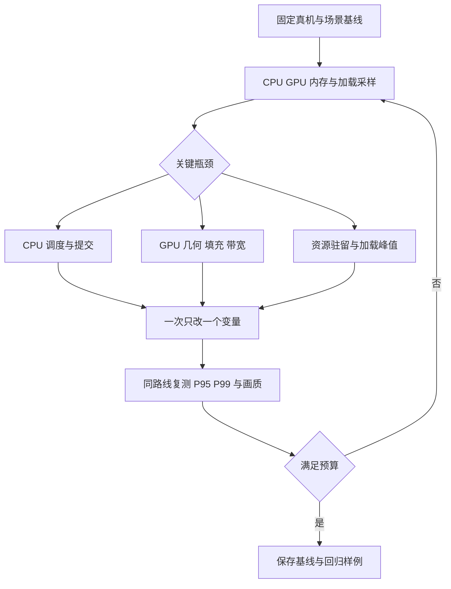
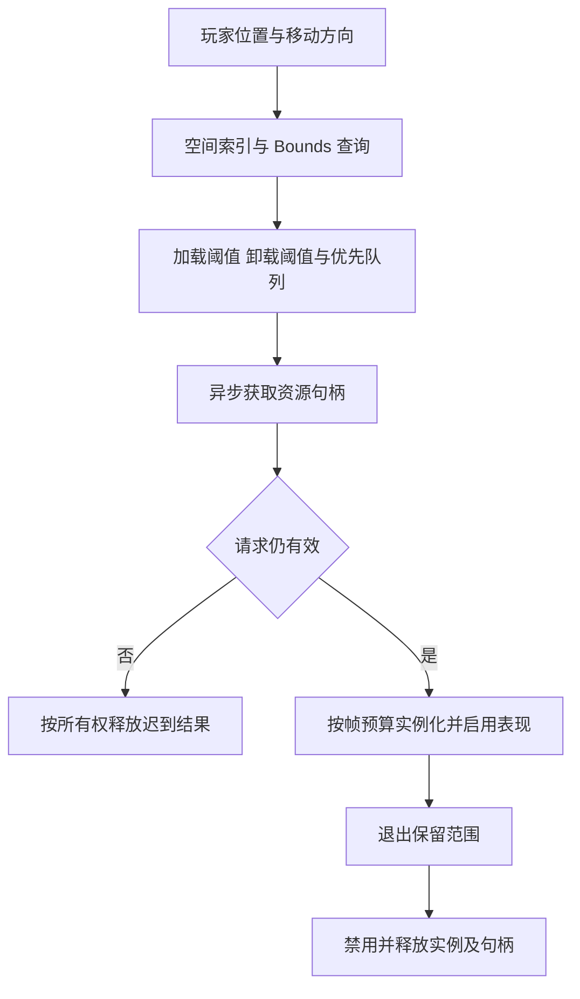
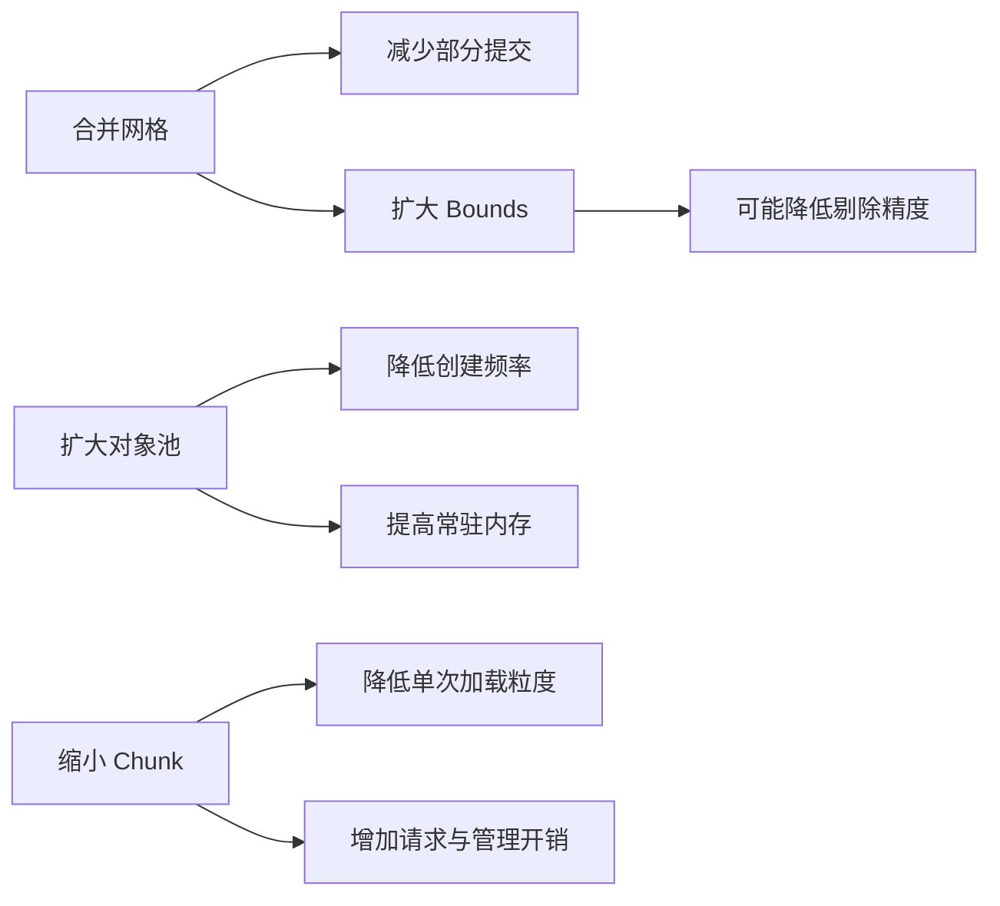

# 因果与执行流程

## 诊断闭环

```mermaid
flowchart TD
  A[固定真机与场景基线] --> B[CPU GPU 内存与加载采样]
  B --> C{关键瓶颈}
  C --> D[CPU 调度与提交]
  C --> E[GPU 几何 填充 带宽]
  C --> F[资源驻留与加载峰值]
  D --> G[一次只改一个变量]
  E --> G
  F --> G
  G --> H[同路线复测 P95 P99 与画质]
  H --> I{满足预算}
  I -->|否| B
  I -->|是| J[保存基线与回归样例]
```

## 场景流送生命周期

```mermaid
flowchart TD
  A[玩家位置与移动方向] --> B[空间索引与 Bounds 查询]
  B --> C[加载阈值 卸载阈值与优先队列]
  C --> D[异步获取资源句柄]
  D --> E{请求仍有效}
  E -->|否| F[按所有权释放迟到结果]
  E -->|是| G[按帧预算实例化并启用表现]
  G --> H[退出保留范围]
  H --> I[禁用并释放实例及句柄]
```

## 关键权衡

```mermaid
flowchart LR
  A[合并网格] --> B[减少部分提交]
  A --> C[扩大 Bounds]
  C --> D[可能降低剔除精度]
  E[扩大对象池] --> F[降低创建频率]
  E --> G[提高常驻内存]
  H[缩小 Chunk] --> I[降低单次加载粒度]
  H --> J[增加请求与管理开销]
```

关联：[[01 GPU与渲染]]、[[03 内存与GC]]、[[07 场景流式与地形]]。
